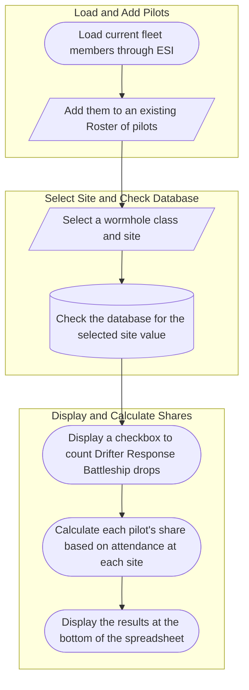
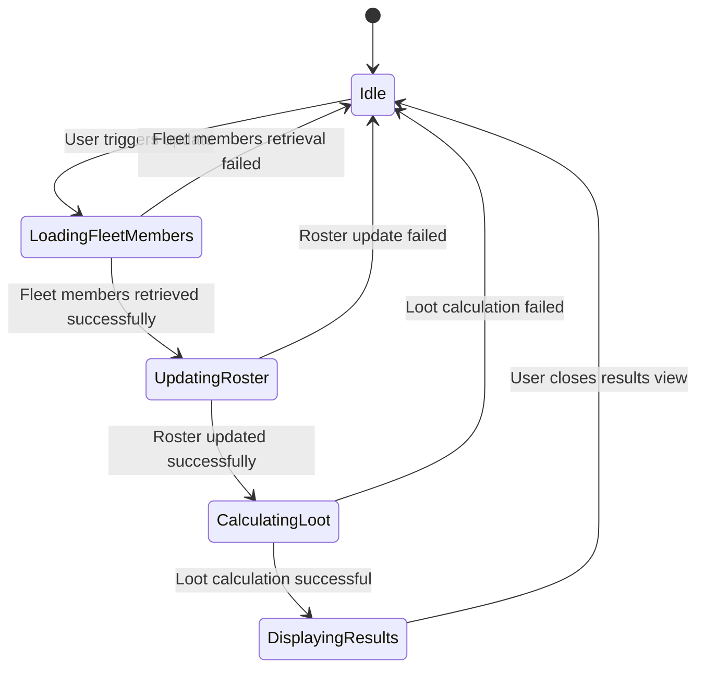
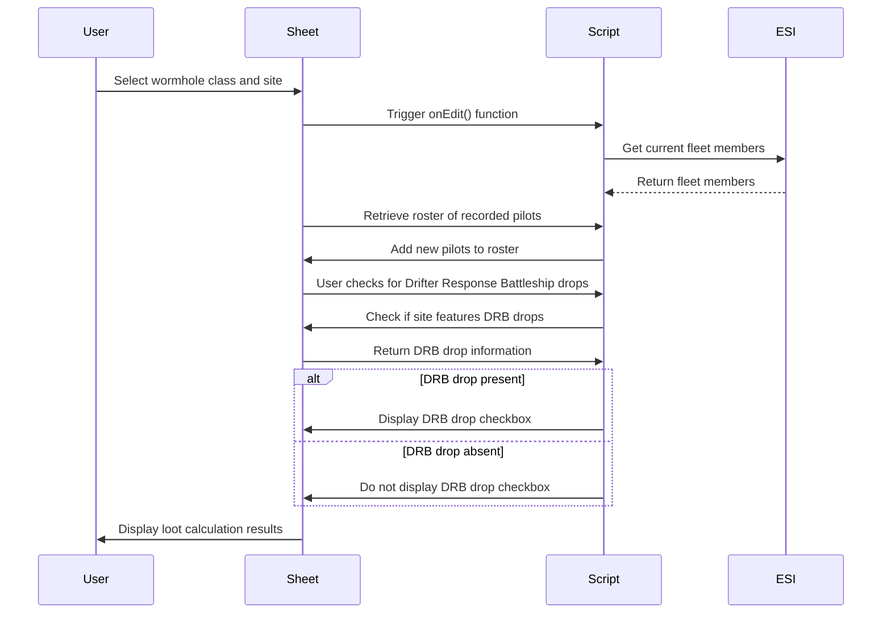
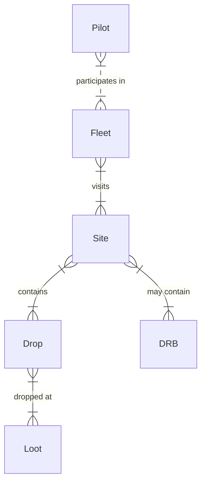
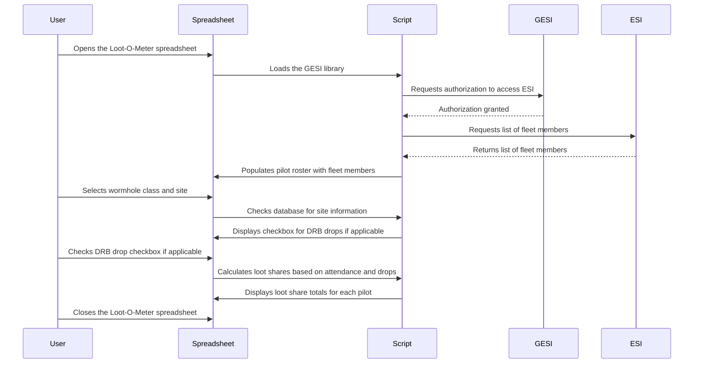

# 🎁Loot-O-Meter <!-- omit from toc -->

## 💰 An Apps Script enhanced ESI connected spreadsheet for wormhole PVE fleet tracking <!-- omit from toc -->

🕹️For the MMORPG [Eve Online](https://www.eveonline.com)

### Table of Contents <!-- omit from toc -->

- [Introduction](#introduction)
  - [Use Cases](#use-cases)
  - [🔥Features](#features)
- [Script Overview](#script-overview)
- [Getting Started](#getting-started)
  - [Download Link](#download-link)
- [Using The Spreadsheet](#using-the-spreadsheet)
  - [Initial Setup](#initial-setup)
    - [Configuration](#configuration)
      - [Alliance Tax](#alliance-tax)
      - [Loot Handler Fee](#loot-handler-fee)
    - [Authorization](#authorization)
    - [Loading Pilots](#loading-pilots)
      - [Loading Current Fleet](#loading-current-fleet)
      - [Running A Site](#running-a-site)
      - [Adding More Pilots](#adding-more-pilots)
      - [Running More Sites](#running-more-sites)
- [Results](#results)
  - [High-Level Overview](#high-level-overview)
    - [Files In This Project](#files-in-this-project)
    - [Flowchart](#flowchart)
  - [State Diagram](#state-diagram)
  - [Sequence Diagram](#sequence-diagram)
  - [Entity Relationship Diagram](#entity-relationship-diagram)
  - [User Journey Diagram](#user-journey-diagram)
    - [Code Explanation](#code-explanation)
      - [`Code.js`](#codejs)
      - [`esi.js`](#esijs)
      - [`ui.js`](#uijs)
      - [`dialogJavaScript.html`](#dialogjavascripthtml)
- [🤝How To Contribute](#how-to-contribute)
  - [One Way](#one-way)
    - [Open An Issue](#open-an-issue)
      - [Report A Bug](#report-a-bug)
      - [Request A Feature](#request-a-feature)
  - [Another Way](#another-way)
    - [Fork The Project](#fork-the-project)
    - [Clone The Repository](#clone-the-repository)
    - [Install Dependencies](#install-dependencies)
    - [🛠️Add A Feature](#️add-a-feature)
    - [Submit Pull Request](#submit-pull-request)
- [Credits](#credits)
- [📜License](#license)

---

## Introduction

The Wormhole Loot-O-Meter offers a simple and easy way to track loot shares for a fleet aimed toward destroying sleepers in J-space.

---

### Use Cases

Any fleet involving multiple players operating on wormhole sleeper sites can benefit from this spreadsheet.

---

### 🔥Features

1. Pilot Roster - Automatically populates the pilot roster from ESI.
2. Easy Data Entry - Pilots can then be added to the line-up from drop-down menus.  
3. ESI Connected - Can load up to the first `x` number of pilots from your fleet into current line-up(`x` being the number of empty pilot slots on the spreadsheet).
4. Wormhole Site Database - Contains data on sites from Class 1 to 6(all wormhole sites).
5. Automatically expanding groups - Keep your sheet compact initially and only expand when you have use the available space.
6. Drifter Error Check - The Drifter checkbox only appears when a site is selected that features a Drifter Response Battleship.

---

## Script Overview

---

## Getting Started

### Download Link

[Click Here](https://docs.google.com/spreadsheets/d/1dKZ7OjaDgEqzoYoaXt_dhMxFHNkrxQLyQP-HsAnjYqo/copy?usp=sharing) to download your own copy of the Wormhole Loot-O-Meter including Apps Scripts.

## Using The Spreadsheet

### Initial Setup

#### Configuration

##### Alliance Tax

##### Loot Handler Fee

#### Authorization

#### Loading Pilots

##### Loading Current Fleet

##### Running A Site

##### Adding More Pilots

##### Running More Sites

## Results

### High-Level Overview

#### Files In This Project

#### Flowchart



### State Diagram



### Sequence Diagram



### Entity Relationship Diagram



### User Journey Diagram



---

#### Code Explanation

##### `Code.js`

##### `esi.js`

##### `ui.js`

##### `dialogJavaScript.html`

---

## 🤝How To Contribute

### One Way

#### Open An Issue

##### Report A Bug

##### Request A Feature

---

### Another Way

#### Fork The Project

#### Clone The Repository

```bash
git clone https://github.com/PhobiaCide/Loot-O-Meter.git
```

#### Install Dependencies

```bash
  npm install
```

#### 🛠️Add A Feature

#### Submit Pull Request

---

## Credits

- The [GESI library](https://github.com/Blacksmoke16/GESI) is used under the MIT license.
- EVE Online and all related logos and images are property of CCP Games.```

## 📜License

Loot-O-Meter is released under the [MIT license](https://opensource.org/licenses/MIT).
